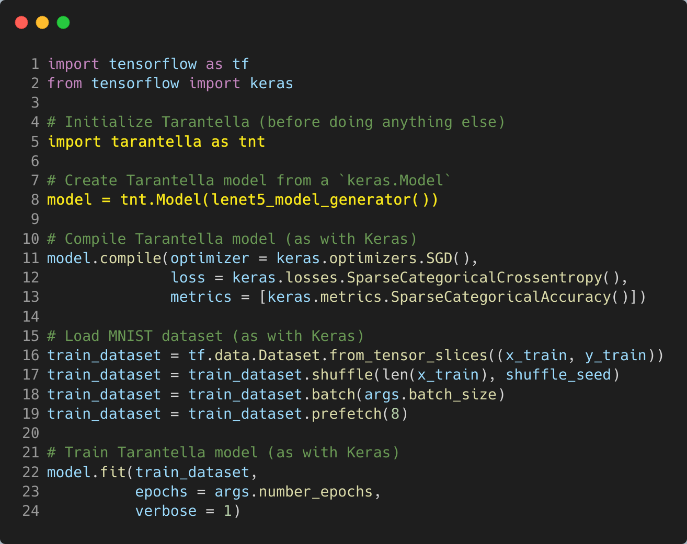
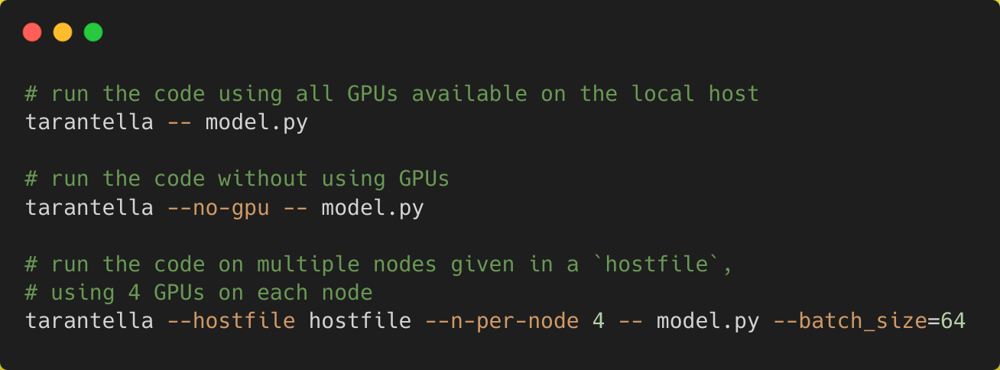

  

Tarantella is an open-source, distributed Deep Learning framework built on top of TensorFlow,
providing scalable Deep Neural Network training on CPU and GPU compute clusters.

Tarantella offers an easy-to-use data parallel solution for speeding up the training of Tensorflow models.
It provides **full support for the TensorFlow Keras and Dataset APIs**, allowing users to
efficiently harness large numbers of compute resources without
requiring any knowledge of parallel computing.

## Goals

Tarantella is designed to meet the following goals:

* ease of use
* synchronous training scheme
* seamless integration with existing Keras models
* support for GPU and CPU systems
* strong scalability

## Quick Start

To get started, you only need to add *two lines of code* to enable data parallel training for your Keras model.

Take a look at the highlighted lines in the following code snippet:

**That's it!**

All the necessary steps to distribute training and datasets will now be automatically handled by Tarantella.
A full version of the above example can be found
[here](https://github.com/cc-hpc-itwm/tarantella/blob/master/docs/source/model.py).

Now simply train the model distributedly by executing one of the following commands:

Detailed instructions and configuration options are provided in
the [technical docs](https://tarantella.readthedocs.io/en/latest/quick_start.html).

## Install

To build Tarantella from source, check out the [installation guide](https://tarantella.readthedocs.io/en/latest/installation.html).

Tarantella relies on the following dependencies:
* [TensorFlow](https://www.tensorflow.org/install) (supported versions 2.0-2.7)
* [GaspiCxx](https://github.com/cc-hpc-itwm/GaspiCxx) (version 1.1.0)
* [GPI-2](https://github.com/cc-hpc-itwm/GPI-2) (from version 1.4.0)

## Resources

* [Official website](https://www.tarantella.org)
* [Technical documentation](https://tarantella.readthedocs.io/en/latest)

## License

Tarantella is licensed under the GPL-3.0 License. See [LICENSE](LICENSE) for details.
