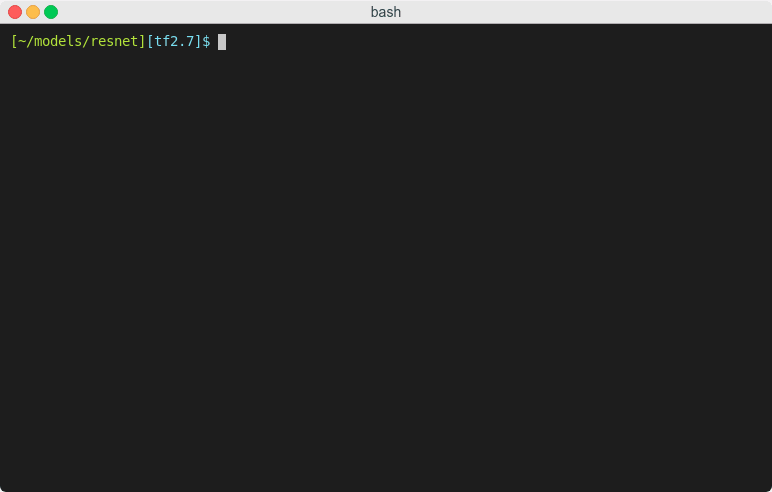

|
`Tarantella <https://github.com/cc-hpc-itwm/tarantella>`_
is an open-source, distributed Deep Learning framework built on top of TensorFlow 2,
providing scalable Deep Neural Network training on CPU and GPU compute clusters.

Tarantella is easy-to-use, allows to re-use existing TensorFlow 2/Keras models,
and does not require any knowledge of parallel computing.

|

Table of contents
=================

.. toctree::
   :maxdepth: 2
   :caption: Overview

   why_tarantella
   data_parallel

.. toctree::
   :maxdepth: 2
   :caption: Getting started

   installation
   quick_start
   tutorials
   advanced_topics
   faq

.. toctree::
   :maxdepth: 2
   :caption: Community

   bug_reports
   contributing
   contact
   license
