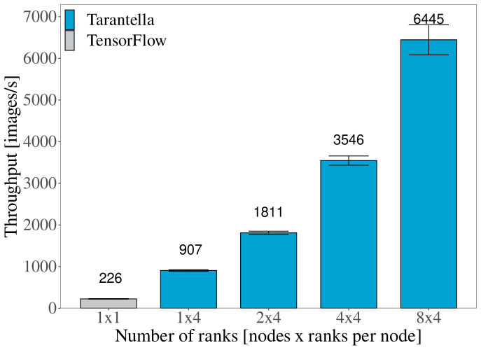
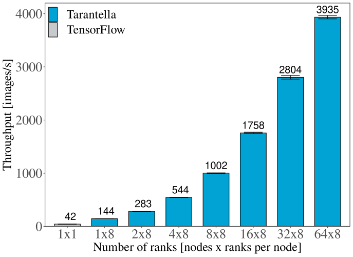
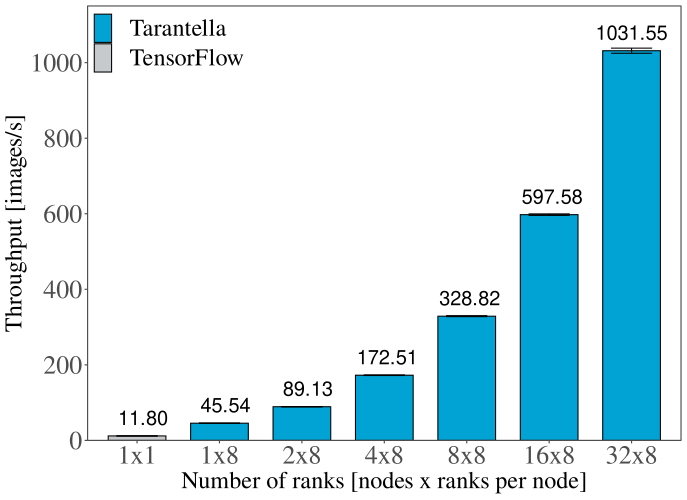
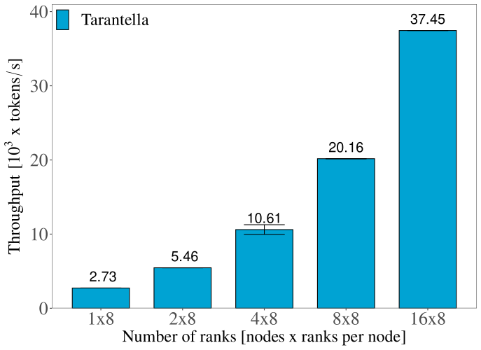

Why Tarantella?
===============

Tarantella is an open-source Deep Learning framework that focuses on providing fast, scalable and
easy-to-use training of Deep Neural Networks (DNNs) on High Performance Computing (HPC) clusters.

Goals
-----

Tarantella is designed to meet the following goals:

.. code-block:: text

  Tarantella...

    1. ...provides strong scalability
    2. ...is easy to use
    3. ...follows a synchronous training scheme
    4. ...integrates well with existing models
    5. ...provides support for GPU and CPU systems

Tarantella speeds up the training of common Deep Learning architectures by scaling up to
large number of devices, thus considerably reducing the required time-to-accuracy in many
Deep Learning workflows.
To make this capability accessible to as many users as possible, Tarantella's interface
is designed such that its use does not require any expertise in HPC or parallel computing.

Tarantella can be integrated into any TensorFlow-based Deep Learning workflow.
We put special emphasis on strictly following the synchronous optimization scheme
typically used to train DNNs. This guarantees that results obtained in serial execution can be
reproduced when using distributed training
(cf. however :ref:`these guidelines <points-to-consider-label>`),
so that computation can be scaled up at any point in time without losing reproducibility
of the results.

Furthermore, we made sure that existing TensorFlow
models can be made ready for distributed training with minimal effort
(follow the :ref:`Quick Start guide <quick-start-label>` to learn more).
Tarantella supports distributed training on both GPU and pure CPU clusters,
independently of the hardware vendors.

Performance Results
-------------------

To investigate the scalability of Tarantella distributed training with respect to the
number of devices used, we performed several experiments across multiple machines and
models used in the fields of computer vision and natural language processing.

We show below some of the results obtained when training two state-of-the-art models
using the data-parallel strategy of Tarantella on two types of machines: the
`Styx <https://www.itwm.fraunhofer.de/de/abteilungen/hpc/Daten-Analyse-Maschinelles-Lernen/styx-gpu-cluster.html>`_ cluster
in `Fraunhofer ITWM <https://www.itwm.fraunhofer.de>`_
is a GPU machine designed for data science workloads, while
`HAWK <https://www.hlrs.de/solutions/systems/hpe-apollo-hawk>`_ from the
`High-Performance Computing Center Stuttgart <https://www.hlrs.de/>`_ is
a typical HPC machine suitable for CPU-intensive simulations.
The hardware details of the two machines used in our experiments are shown below.

================ ====================================
Cluster          Hardware specifications per node
================ ====================================
Styx              - 4 x NVIDIA VOLTA V100 GPU with 12GB HBM2
                  - 2 x Intel Xeon 4108 CPU (8 cores @1.80 GHz)
                  - 2 x 100 Gbit/s Infiniband interconnect between nodes

HAWK              - 2 x AMD EPYC 7742 CPU (64 cores @2.25 GHz)
                  - 200 Gbit/s Enhanced 9D-Hypercube InfiniBand HDR200
================ ====================================

All experiments presented below showcase Tarantella in comparison to
single-device TensorFlow, without configuring any parallelization strategy within the
TensorFlow framework itself. We used `TensorFlow 2.9` as the backend for Tarantella
across all the experimental evaluations.

First we look at the speedups that Tarantella can achieve when scaling
up the number of devices for the ResNet-50 model trained with the ImageNet dataset.
ResNet-50 is one of the most studied deep neural networks for computer vision tasks,
featuring over `23 million` trainable parameters.

More specifically, Figure 1 illustrates the training throughput, measured as the
number of images  processed per second, on the `Styx` cluster, when using up to `32` GPUs.
It shows that training times scale almost linearly with the number of GPUs,
achieving a **90%** parallel efficiency.

   Figure 1. Training Resnet-50 on GPUs

We performed more detailed experiments on the `HAWK` machine, on which we could
scale up to **512** processes on 64 CPU nodes on even larger models. The table below summarizes the
properties of all models used in the experiments.

================ ================== ======== ======== ================
Model class       Model              #Params  FLOPs   Micro-batch size
================ ================== ======== ======== ================
Computer Vision   Resnet-50           25.5 M 7.7 G    64

                  Resnet-152          60 M   3.2 G    64

                  EfficientNet-B3     14.4 M 22.5 G   128

NLP               Transformer (big)   213 M  4 T      4096
================ ================== ======== ======== ================

Figure 2 highlights the throughput of training `EfficientNet-B3`, as well as the
advantages of parallelizing the workload even within a single node. While TensorFlow
cannot take advantage of the node-level hardware hierarchy, Tarantella can parallelize
its workload also across NUMA domains.
As a result, Tarantella is able to achieve a significant speedup even at a single node
level, as shown in Figure 2 in the `1x8` test case (8 Tarantella processes per node)
versus `1x1` result (single instance of TensorFlow).

   Figure 2. Training EfficientNet-B3 on CPUs

Figure 3 presents similar results obtained with `Resnet-152`, another massive convolutional
network.
Compared to the baseline single-instance training using
TensorFlow, Tarantella succeeds in speeding up each epoch **93 times** for `EfficientNet-B3`,
and **87 times** in the case of `Resnet-152`.

   Figure 3. Training Resnet-152 on cPUs

The Transformer is another widely-popular model that originated in the field of
natural language processing (NLP).
With more than `200 million` parameters, training the `Transformer (big)` model
heavily relies on data paralellism to achieve reasonable training times.
We show that Tarantella distributed training also scales when using the Transformer
for a translation task trained on the WMT17 English-German Translation dataset.

Figure 4 gives an insight of the time savings that Tarantella-based training can
attain on the `HAWK` cluster, reaching a **54x speedup** for one epoch on `16` nodes.

   Figure 4. Training the Transformer (big) on CPUs

To find out more about training such models with Tarantella, take a look at our
:ref:`tutorials<tutorials-label>`.
