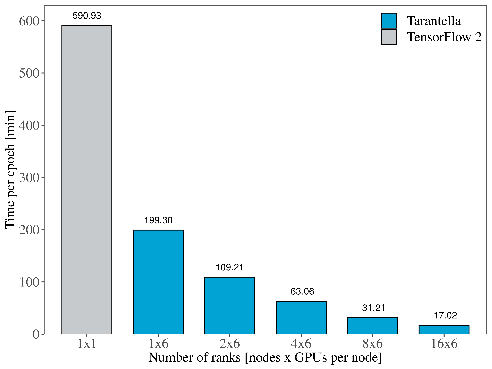

Why Tarantella?
===============

Tarantella is an open-source Deep Learning framework that focuses on providing fast, scalable and
efficient training of Deep Neural Networks (DNNs) on High Performance Computing (HPC) clusters.

Goals
-----

Tarantella is designed to meet the following goals:

.. code-block:: text

  Tarantella...

    1. ...provides strong scalability
    2. ...is easy to use
    3. ...follows a synchronous training scheme
    4. ...integrates well with existing models
    5. ...provides support for GPU and CPU systems

Tarantella provides close to linear speed-up for the training of common Deep Learning architectures,
thus considerably reducing the required time-to-accuracy in many Deep Learning workflows.
To make this capability accessible to as many users as possible, Tarantella's interface
is designed such that its use does not require any expertise in HPC or parallel computing.

To allow integrating Tarantella into any TensorFlow-based Deep Learning workflow,
we put special emphasis on strictly following the synchronous optimization scheme
used to train DNNs. This guarantees that results obtained in serial execution can be
reproduced when using distributed training
(cf. however :ref:`these guidelines <points-to-consider-label>`),
so that computation can be scaled up at any point in time without losing reproducibility
of the results.

Furthermore, we made sure that existing TensorFlow 2/Keras
models can be made ready for distributed training with minimal effort
(follow the :ref:`Quick Start guide <quick-start-label>` to learn more).
Tarantella supports distributed training on GPU and pure CPU clusters,
independently of the hardware vendors.

Performance Results
-------------------

To investigate the scalability of Tarantella distributed training with respect to the
number of devices used, we performed several experiments across multiple machines and
models used in the fields of computer vision and natural language processing.

We show below some of the results we obtained when training two state-of-the-art models
in parallel with Tarantella on two types of machines: the
`HPC-DA <https://doc.zih.tu-dresden.de/hpc-wiki/bin/view/Compendium/HPCDA>`_ cluster
of the `Technical University of Dresden <https://tu-dresden.de>`_
is a machine designed for data science workloads, equipped with `6` GPUs per node, while
`SuperMUC-NG <https://doku.lrz.de/display/PUBLIC/SuperMUC-NG>`_ from the
`Leibniz Supercomputing Centre <https://www.lrz.de/english/>`_ is
a typical HPC machine suitable for CPU-intensive simulations.
The hardware details of the two machines used in our experiments are shown below.

============  ====================================
Cluster          Hardware specifications per node
============  ====================================
HPC-DA        - 6 x NVIDIA VOLTA V100 GPU with 32GB HBM2
              - 2 x IBM Power9 CPU (22 cores @2.80 GHz)

              - NVLINK bandwidth 150 GB/s between GPUs and host
              - 2 x 100 Gbit/s Infiniband interconnect between nodes

SuperMUC-NG   - 2 x Intel Skylake Xeon Platinum 8174 CPU (48 cores @3.10 GHz)
              - 100 Gbit/s OmniPath network
============  ====================================

First we look at the speedups that Tarantella can achieve when scaling
up the number of devices for the ResNet-50 model trained with the ImageNet dataset.
ResNet-50 is one of the most studied deep neural networks for computer vision tasks,
featuring over `23 million` trainable parameters.

More specifically, Figure 1 illustrates the runtime per epoch on the `HPC-DA`
cluster, when using up to `96` GPUs. Figure 2 showcases the same experiment performed
on CPUs on the `SuperMUC-NG` machine, showing that training ResNet-50 distributedly
scales on up to `256` processes.
Compared to the baseline single-device runtime of the ResNet-50 model using
TensorFlow 2.2, Tarantella succeeds in training the model **62x faster** on the
CPU cluster and **57x faster** on the GPUs.
   
.. list-table::

  * - .. figure:: pics/resnet50_epoch_runtimes_bs64_cpu.png

        Figure 1. Training Resnet-50 on CPU nodes

    - .. figure:: pics/resnet50_epoch_runtimes_bs64_gpu.png

        Figure 2. Training Resnet-50 on GPUs

The Transformer is another widely-popular model that originated in the field of
natural language processing (NLP).
With more than `200 million` parameters, training the transformer (big) model
heavily relies on data paralellism to achieve reasonable training times.
We show that Tarantella distributed training also scales when using the Transformer
for a translation task trained on the WMT14 English-German Translation dataset.

Figure 3 gives an insight of the time savings that Tarantella-based training can
attain on a GPU machine such as the `HPC-DA` cluster, reaching a **34x speedup**
for one epoch on `96` devices.

   Figure 3. Training the Transformer (big) on GPUs

To find out more about training such models with Tarantella, take a look at our
:ref:`tutorials<tutorials-label>`.
